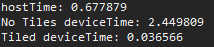

# 5x5_Gaussian_Blur

#### Currently only supports Images with the RGB channel !

## Gaussian Blur 5x5 Kernel on the Host and Device in Visual Studio 2022 (MSVC)
### Host
- Single threaded C++14.

### Device
- Cuda C++
- Cuda C++ with tiling

## Benchmarks
Single Blur Pass

